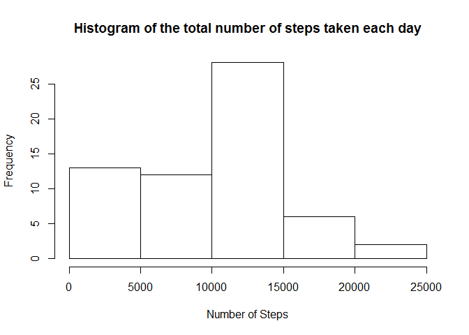
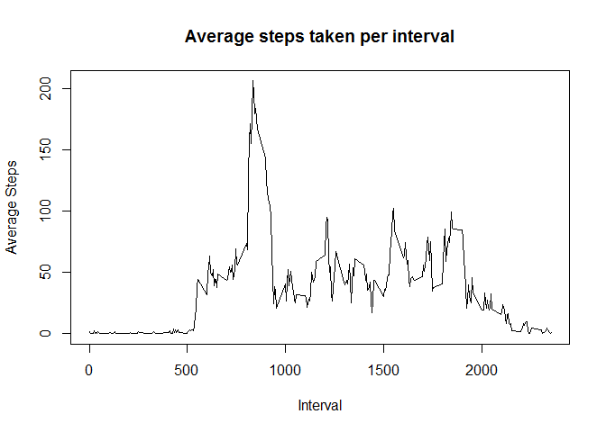
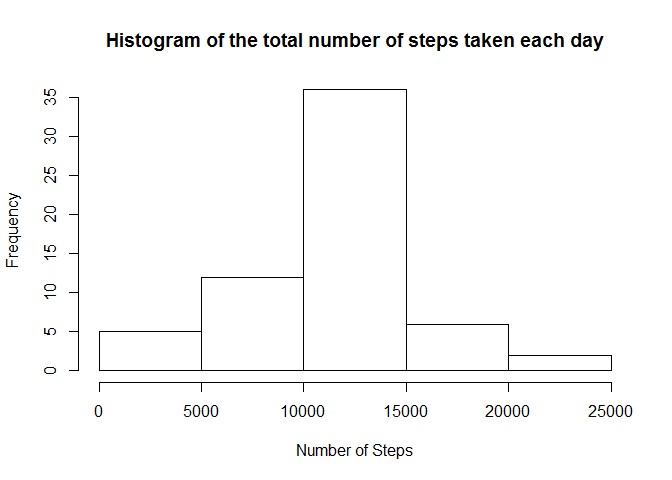
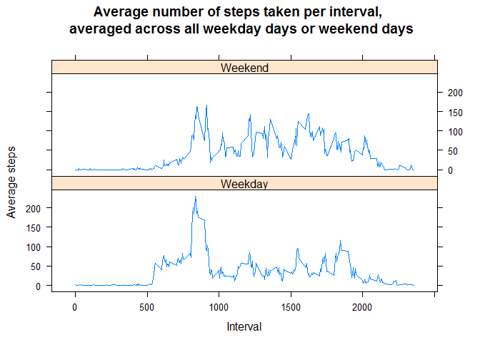

# Reproducible Research: Peer Assessment 1


## Loading and preprocessing the data

```r
##setwd("../Git/RepData_PeerAssessment1/")        ##set working directory
unzip("activity.zip")                           ##Unzip file
data <- read.csv("activity.csv", sep = ",", header = TRUE)      ##Read activity file
data$Date <- as.Date(as.character(data$date), format = "%Y-%m-%d")      ##Set up date variable
```

## What is mean total number of steps taken per day?

```r
library(plyr)
stepsday <- ddply(data, .(date), summarize, totsteps = sum(steps, na.rm = TRUE)) ## Calculate total steps each day
hist(stepsday$totsteps, xlab = "Number of Steps", main = "Histogram of the total number of steps taken each day") ##create histogram of steps taken each day
```

 

```r
meansteps <- round(mean(stepsday$totsteps))         ## Calculate and report the mean total number of steps taken per day
mediansteps <- median(stepsday$totsteps)      ## Calculate and report the median total number of steps taken per day
print(options(scipen=999)) ## Remove scientific notation from displayed numbers
```

```
## $scipen
## [1] 0
```

The mean number of steps taken per day was 9354.  

The median number of steps taken per day was 10395.

## What is the average daily activity pattern?

```r
stepsminute <- ddply(data, .(interval), summarize, meansteps = mean(steps, na.rm = TRUE)) ## Calculate total steps each interval
plot(meansteps~interval,type = "l",xlab = "Interval", ylab = "Average Steps", main = "Average steps taken per interval", data = stepsminute)     ##plot average steps taken in each time interval over all days 
```

 

```r
maxsteps <- stepsminute[which.max(stepsminute$meansteps),] ##subset for interval with most steps
maxsteps
```

```
##     interval meansteps
## 104      835  206.1698
```
The 5 minute interval that contained on average the most steps was interval 835 with 206 steps per day.

## Imputing missing values      

```r
datar <- data           ##Create new data frame in which to replace NA values
sumna <- sum(is.na(data$steps))          ## calculate total NAs in data set
```
The total number of missing values in the data set is 2304.


```r
for (i in 1:nrow(datar)){        ##Replace NAs with mean for that interval
                
        if (is.na(datar[i,"steps"])){           
                datar[i, "steps"] <- stepsminute[stepsminute$interval == datar[i,"interval"],"meansteps"]       
        }
} 
                
stepsdayr <- ddply(datar, .(date), summarize, totsteps = sum(steps)) ## Recalculate daily steps
hist(stepsdayr$totsteps, xlab = "Number of Steps", main = "Histogram of the total number of steps taken each day") ##create histogram of steps taken each day
```

 

```r
meanstepsr <- round(mean(stepsdayr$totsteps))         ## Calculate and report the mean total number of steps taken per day
medianstepsr <- round(median(stepsdayr$totsteps))       ## Calculate and report the median total number of steps taken per day
```

The mean number of steps taken per day with missing data replaced was 10766. This is up from the number of 9354 before the missing values were replaced.  

The median number of steps taken per day with missing data replaced was 10766. This is also up from the number of 10395 before the missing values were replaced.  

## Are there differences in activity patterns between weekdays and weekends?

```r
datar[as.POSIXlt(datar$Date)$wday > 0 & as.POSIXlt(datar$Date)$wday < 6,"day"] <- "Weekday" ##Calculate weekdays
datar[as.POSIXlt(datar$Date)$wday < 1 | as.POSIXlt(datar$Date)$wday > 5,"day"] <- "Weekend" ##Calculate weekends
datar$day <- as.factor(datar$day) ##Convert new variable to factor

stepsminuteday <- ddply(datar, .(day,interval), summarize, meansteps = mean(steps, na.rm = TRUE)) ## Calculate total steps each interval per day type

library(lattice)        ##Call graphing library.

xyplot(meansteps~interval|day, scales=list(cex=.8), layout = c(1, 2), data = stepsminuteday,xlab="Interval", ylab="Average steps", main= "Average number of steps taken per interval, \n averaged across all weekday days or weekend days", type = "l")  ##Plot both weekday and weekend steps per interval
```

 

There is a difference between activity patterns during the week as opposed to the weekend. On the weekend, there is more activity in the middle of the day as well as more activity later into the evening. There is also evidence of our subject sleeping in on the weekend.
